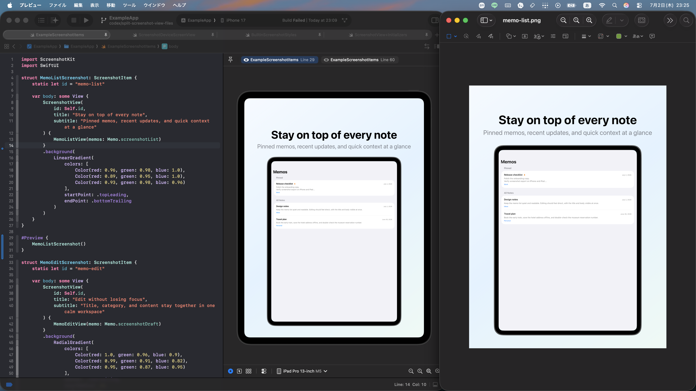

# ScreenshotKit

[English README](README.md)

ScreenshotKit は、SwiftUI アプリから App Store 用スクリーンショットを量産するための Swift Package です。

スクリーンショット用の画面を SwiftUI で定義し、`#Preview` で見た目を詰め、そのまま iPhone / iPad・全ローカライズへ書き出せます。UI Test には依存しません。

## 何ができるか

ScreenshotKit は、スクショ制作を「アプリ本体とは別の作業」ではなく、プロダクトコードの延長として扱いたいときに向いています。

- App Store 用のスクリーンショットを iPhone / iPad 向けにまとめて生成できる
- SwiftUI と `#Preview` で見た目を編集できる
- 本番コードや fixture の変更をすぐスクショに反映できる
- UI Test ベースの重い撮影フローを持たず、軽量に回せる
- コード上で定義したスクリーンショット一覧と `.xcodeproj` の対応言語をベースに、必要なケースをまとめて出力できる
- スクショ制作をアプリプロジェクトの中に閉じ込めたまま運用できる



## クイックスタート

### 前提

- iOS 17 以降
- Swift 6
- Xcode 26 以降
- `xcrun`, `xcodebuild`, `python3` が使えること

### 1. パッケージを追加する

Xcode の `Add Package Dependency...` から次を追加します。

```text
https://github.com/kmatsushita1012/ScreenshotKit.git
```

`Package.swift` なら次です。

```swift
dependencies: [
    .package(url: "https://github.com/kmatsushita1012/ScreenshotKit.git", from: "1.3.1")
]
```

### 2. ルート View にスクショ対象を登録する

```swift
import ScreenshotKit
import SwiftUI

@main
struct MyApp: App {
    var body: some Scene {
        WindowGroup {
            RootView()
                .screenshot {
                    HomeScreenshot()
                    SettingsScreenshot()
                }
        }
    }
}

struct HomeScreenshot: ScreenshotItem {
    static let id = "home"

    var body: some View {
        ScreenshotView(
            title: "すべてを一箇所で確認",
            subtitle: "進捗・状態・最近の動きをまとめて見せる"
        ) {
            HomeContentView(item: .fixture)
        }
        .background(Color(red: 0.93, green: 0.96, blue: 1.0))
    }
}
```

### 3. exporter を実行する

このパッケージのリポジトリ上で次を実行します。

```bash
swift run screenshotkit-export --project ExampleApp/ExampleApp.xcodeproj --output-dir ./output
```

別アプリを書き出すときは `--project` に対象の `.xcodeproj` を渡してください。

## 仕様

### 起動フロー

1. exporter がアプリを `manifest` モードで起動する
2. ScreenshotKit が登録済み `ScreenshotItem` と localization 一覧を読む
3. `locale × scene` の manifest を作る
4. exporter が各キャプチャジョブごとにアプリを再起動する
5. ScreenshotKit が指定 scene を描画して readiness を通知する
6. exporter が Simulator 上の表示結果を PNG として保存する

UI Test を介さず、役割分担がはっきりしているのがこの方式の強みです。

### ローカライズ

ScreenshotKit は、ビルドされたアプリ bundle に含まれる localization を読むため、実際の出力対象はコード上のスクリーンショット定義と `.xcodeproj` の対応言語で決まります。

- `Base` は無視する
- `ja` は `ja-JP`、`en` は `en-US` のように正規化する
- localization が明示されていなければ development localization、さらに無ければ現在 locale を使う

運用としては次の理解で十分です。

- Xcode 側で対応言語を設定する
- スクショ内の文言も通常どおりローカライズする
- 1 回の export で対応言語をまとめて生成する

`.xcodeproj` は exporter 側で自動発見に使われ、そこから app build settings を引き当てます。言語の最終的な列挙は、実際に build された app bundle を正として行われます。

### 出力構造

アプリコンテナ内では、セッションごとに次のような構造を管理します。

```text
Application Support/
  ScreenshotKit/
    Sessions/
      latest-session.txt
      session-20260702-120000-000/
        manifest.json
        capture-complete
        iPhone 17 Pro Max/
          en-US/
            home.png
```

その後 exporter が最終成果物を指定ディレクトリへコピーし、device ごとに manifest も残します。

### 注意点

- iOS 専用です
- exporter は `.xcodeproj` を見つけられるアプリプロジェクト前提です
- 画像ベース scene を使う場合は対象 asset を app target に含めてください

## 応用

### `ScreenshotItem.id` と出力ファイル名

`ScreenshotItem.id` は各スクリーンショット scene の単一の識別子です。

この値が scene の切り替え、manifest の記録、最終的な PNG ファイル名にそのまま使われます。たとえば `detail` なら `detail.png` になります。

```swift
struct DetailScreenshot: ScreenshotItem {
    static let id = "detail"

    var body: some View {
        ScreenshotView(
            title: "詳細をじっくり見せる",
            subtitle: "1 つの操作に集中した訴求ができる"
        ) {
            DetailContentView(item: .fixture)
        }
        .background(Color.indigo)
    }
}
```

### `ScreenshotView`

`ScreenshotView` では、次の 2 種類の scene を扱えます。

- trailing closure で SwiftUI の View を渡す
- `ScreenshotImage` で iPhone / iPad 用の画像 asset を渡す

```swift
struct HomeScreenshot: ScreenshotItem {
    static let id = "home"

    var body: some View {
        ScreenshotView(
            title: "すべてを一箇所で確認",
            subtitle: "進捗・状態・最近の動きをまとめて見せる"
        ) {
            HomeContentView(item: .fixture)
        }
        .background(Color(red: 0.93, green: 0.96, blue: 1.0))
    }
}
```

```swift
struct PromoScreenshot: ScreenshotItem {
    static let id = "promo"

    var body: some View {
        ScreenshotView(
            title: "各デバイスの見せ方を最適化",
            subtitle: "iPhone と iPad で別の素材を使い分ける",
            image: .init(phone: "PromoPhone", pad: "PromoPad")
        )
        .background(Color(red: 0.95, green: 0.95, blue: 0.98))
    }
}
```

`ScreenshotImage` は現在の device kind に応じて使う asset 名を選びます。

### 画像ベースの scene

Widget や extension UI のように、通常のアプリ画面として組みにくいものは画像ベースでも扱えます。

```swift
struct AlarmScreenshot: ScreenshotItem {
    static let id = "alarm"

    var body: some View {
        ScreenshotView(
            title: "拡張 UI もそのまま訴求",
            subtitle: "実画面と素材画像を同じ export フローで混ぜられる",
            image: .init(phone: "AlarmPhone", pad: "AlarmPad")
        )
        .background(Color(red: 0.95, green: 0.95, blue: 0.98))
    }
}
```

同じ画像を両デバイスで使う場合は、同じ asset 名を 2 回渡してください。

### Export executable

exporter は位置引数と named option の両方に対応しています。

```bash
swift run screenshotkit-export [output-dir] [device-id]
swift run screenshotkit-export --output-dir ./output --device-id <simulator-udid>
swift run screenshotkit-export --project path/to/App.xcodeproj
```

exporter は利用可能なアプリプロジェクトを見つけ、最新の iOS runtime から代表的な iPhone / iPad Simulator を選び、app bundle に含まれる各 locale ごとに書き出し、device ごとの manifest を出力先へ保存します。

### ExampleApp

最小構成のサンプルは [`ExampleApp/`](ExampleApp) に入っています。

- [`ExampleApp/ExampleApp/ExampleApp.swift`](ExampleApp/ExampleApp/ExampleApp.swift)
- [`ExampleApp/ExampleApp/ExampleScreenshotItems.swift`](ExampleApp/ExampleApp/ExampleScreenshotItems.swift)

組み込み方法、Preview ベースの編集感、export の流れを確認する出発点として使えます。

## License

MIT です。詳細は [LICENSE](LICENSE) を参照してください。
