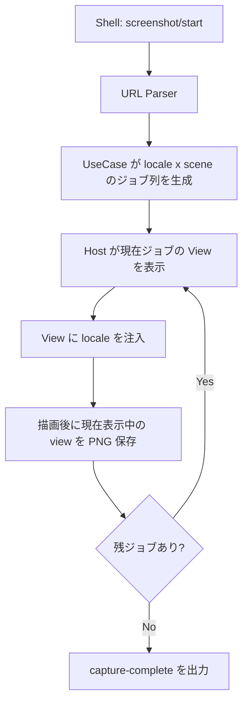

# ScreenshotKit 設計

## Summary

- 旧設計の `start -> next -> simctl screenshot` を廃止し、`start` 1 回で完了するアプリ内バッチ実行へ変更した。
- 起動中デバイス上で現在表示中の UIKit view をそのまま実サイズ・実 scale で PNG 化する。
- 進行状態は JSON ではなく、メモリ上のジョブ列とセッションディレクトリで管理する。

## Layering

- `Presentation`
  - `ScreenshotContainerView` が通常表示とキャプチャモードを切り替える
  - `ScreenshotHostView` が現在ジョブの View を 1 件だけ表示する
  - `RenderedScreenshotScene` が locale 注入と描画完了通知を担当する
- `Application`
  - `HandleScreenshotCommandUseCase` が `start` からジョブ列を作る
  - `ValidateScreenshotItemsUseCase` が scene 識別子を検証する
- `Infrastructure`
  - `ScreenshotURLParser` が `deviceName` 付き URL を解釈する
  - `ScreenshotLocaleProvider` が `Bundle` から locale 一覧を返す
- `ScreenshotProgressStore` がセッション作成、PNG 保存、manifest、完了/失敗マーカー書き込みを行う

## Domain Types

```swift
public enum ScreenshotCommand {
    case start(deviceName: String)
}
```

```swift
public struct ScreenshotDescriptor {
    public let id: String
    public let fallbackOutputIdentifier: String
}
```

```swift
public struct ScreenshotCaptureJob {
    public let sceneID: String
    public let localeIdentifier: String
    public let fallbackOutputIdentifier: String
}
```

```swift
public struct ScreenshotProgress {
    public let current: ScreenshotCaptureJob?
    public let pending: [ScreenshotCaptureJob]
    public let finished: Bool
    public let sessionDirectoryPath: String?
    public let completedCount: Int
    public let totalCount: Int
    public let deviceName: String
}
```

## Capture Flow



## File Output

- ベース: `Application Support/ScreenshotKit/Sessions/`
- セッション: `session-<timestamp>/`
- 最新セッション参照: `latest-session.txt`
- 完了: `capture-complete`
- 失敗: `capture-error.txt`
- manifest: `manifest.json`
- 画像: `<deviceName>/<locale>/<outputIdentifier>.png`

## Decisions

- locale 一覧は API 引数ではなく `Bundle` から自動取得する
- URL 形式は `myapp://screenshot/start?...`、`myapp://screenshots/start?...`、`myapp:/screenshots/start?...` を受ける
- Shell は `device-id` を指定された場合は 1 台のみ、未指定時は iPhone / iPad の 2 台を並列実行する
- `ScreenshotItem.id` は内部 scene 識別用に維持する
- 保存用 `id` は `ScreenshotView(id:)` に寄せる
- `ScreenshotView(id:)` 未指定時は登録順で 3 桁連番を付与する
- `ScreenshotView(image:)` は content 部分だけを asset 画像へ差し替える
- 背景は `ScreenshotView` の initializer ではなく通常の `.background(...)` に寄せる
- 保存は `id` 解決後に直列で進める
- `next` は廃止し、外部から scene 進行を制御しない

## Test Targets

- `HandleScreenshotCommandUseCase`
  - `start` で全 locale × 全 scene のジョブ列を作る
  - locale または scene が空なら即 finished
- `ScreenshotURLParser`
  - `deviceName` を query から読み取る
  - パス不正や scheme 不一致は `nil`
- `ScreenshotProgressStore`
  - セッション生成
  - `<device>/<locale>/<id>.png` への保存
  - 完了/失敗マーカー作成
